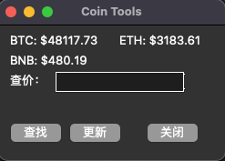

# 币圈小工具


实时价格显示，币价查询工具。

说明：
数据源来自币安API，显示价格会每分钟更新一次实时价格。

## 效果展示



## 配置文件

修改配置 `config/api.json` 中 `key` 与 `secret` 对应的值， 填写上币安api的配置.

{
"base_url": "https://api2.binance.com",
"key": "xxx",
"secret": "xxxx"
}

## 环境安装

```bash
pip3 install -r requirements.txt
```

## 运行程序

```bash
python main.py
```

## 使用

查价区域输入对应币种，如：btc(不区分大小写)，按回车或者点击查找均可查询价格


## 常见问题

### 接口无法访问， 可以在配置文件`config/api.json`中增加

> "proxies": "https://127.0.0.1:1080"

### 取消窗口置顶

```python
# 找到下面代码， 如下加上#注释即可
# self.wm_attributes('-topmost', 1)
```


